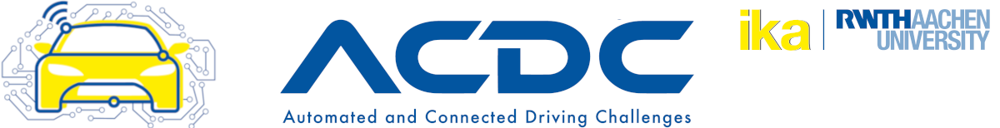
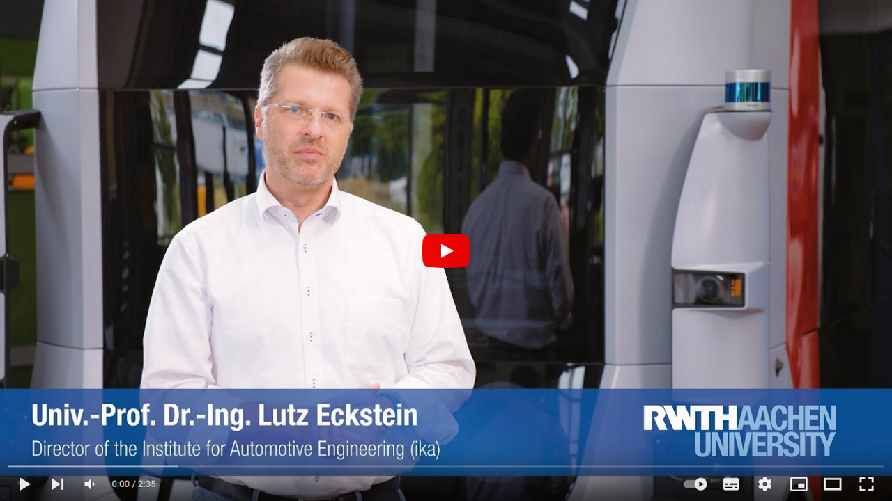

[](https://github.com/ika-rwth-aachen/acdc/actions/workflows/build.yml)

# Automated and Connected Driving Challenges (ACDC)

This repository belongs to the **Automated and Connected Driving Challenges (ACDC)**, a Massive Open Online Course (MOOC) on [edX.org](https://www.edx.org/course/automated-and-connected-driving-challenges), teaching how to solve current challenges in the field of automated and connected mobility. This repository contains programming tasks relating to the [Robot Operating System (ROS)]((https://ros.org/)).

Watch the **Course Trailer** for a quick introduction to the course:

[](https://www.youtube.com/watch?v=XR2uBMVX1As)

**Enroll** in the course **for free** [here](https://www.edx.org/course/automated-and-connected-driving-challenges) and learn how to shape future automated and connected mobility!

The course is taught by the [Institute for Automotive Engineering (ika)](https://www.ika.rwth-aachen.de/) of [RWTH Aachen University](https://rwth-aachen.de) in Germany.

## Repository Content
For the complete course content including the solutions to all programming tasks in the course, please enroll in the course. 

If you want to get to know the programming tasks of this repository, you can find instructions in the Repository's [**Wiki**](https://github.com/ika-rwth-aachen/acdc/wiki).

We offer additional programming tasks in the form of Jupyter Notebooks [here](https://github.com/ika-rwth-aachen/acdc-notebooks).

## Quick Start

All programming tasks can be run inside of a Docker container, which we provide. 

0. Follow all steps described under [Installation](https://github.com/ika-rwth-aachen/acdc/wiki#installations) in this repository's Wiki.

1. Clone this repository with the contained submodules:
    ```bash
    git clone --recurse-submodules https://github.com/ika-rwth-aachen/acdc.git
    ```

2. Pull the Docker image that is needed to run our tasks.:
    ```bash
    docker pull rwthika/acdc:latest
    ```

3. In a terminal, navigate to the Docker directory of this repository and launch the ACDC Docker container with the provided run script:
    ```bash
    # acdc/docker
    ./run.sh
    ```

## License

Copyright (c) 2022, Institute for Automotive Engineering (ika), RWTH University
