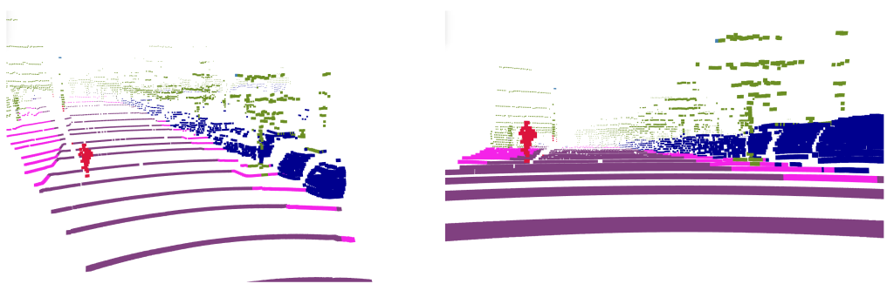

# Python ROS Package for the Inference of a Semantic Point Cloud Segmentation Tensorflow-Model


This repository contains an inference node for semantic point cloud segmentation. The model is trained with an automatically annotated dataset that is obtained by cross-modal label transfer. The node is using Tensorflow 2.x.


- Input: `/points2` with `XYZIR` fields
	- `X` X-Coordinate
	- `Y` Y-Coordinate
	- `Z` Z-Coordinate
	- `I` Intensity
	- `R` Ring
- Output: `/points2_segmented` with `XYZILRGB` fields
	- `X` X-Coordinate
	- `Y` Y-Coordinate
	- `Z` Z-Coordinate
	- `I` Intensity
	- `L` Label ID
	- `RGB` Color associated with the label ID

The field of the input point cloud are mandatory. The ring information is necessary to build up the input tensor of the network. Accordingly the LiDAR-scanner driver should also include the ring information in the `/points2` message.


## Class Color Mapping
The mapping of the *class ids* and the colors are defined in the file `class_id_to_rgb.xml`.

For example:
```xml
<SLabel fromColour="128 64 128" toValue="0" Name="Road"/>
```
That means *class id* `0` corresponds to the semantic label *road* and has the RGB color `128 64 128`. Note that the colors in this xml file correspond to the color scheme in the Cityscapes dataset.


This `xml`-file should be identical to the `xml`-file used during training and data generation.


## Parameters
- *num_classes*: 11
	- The number of classes that the network was trained on. Note that the *None* class corresponds to the last class in that list (`class_id=num_classes-1`). All points that a classified as the *None* class by the network are discarded and not published.
- *leftPhi*: 24.32
	- The left opening angle of the FOV (Only in this region data was presented to the network during training)
- *rightPhi*: 22.23
	- Right opening angle of the FOV (Only in this region data was presented to the network during training)
- *zenith_level*: 32
	- That is the height of the input tensor. It corresponds to the 32 layers of the VLP-32c LiDAR scanner
- *azimuth_level*: 240
	- That is the width of the input tensor. This value depends on the horizontal discretization. It is also important that this value is even divisible by the output stride of the network (for squeezeseg `OS=16`).
- *input_mean*: [25.605, 0.853, 0.000, 16.880, 26.251]
	- For the normalization of the input. Each elemnts correspond to the mean of `XYZID` where `D` is the depth. These values are determined by the data preprocessing for the segmentation model.
- *input_std*: [30.471, 7.912, 2.093, 25.545, 31.028]
	- For the normalization of the input. Each elemnts correspond to the std of `XYZID` where `D` is the depth. These values are determined by the data preprocessing script for the segmentation model.


## Download Model files
The SavedModel files are tracked with __GIT LFS__. Make sure to download the SavedModel files with
```
git lfs fetch --all
git lfs checkout
```


## Inference Example 
With the ros parameter `do_visualizations` it is prossible to visualize the output of the network as shown below. 


                     Model Prediction                                                Ground Truth (manually annotated)



